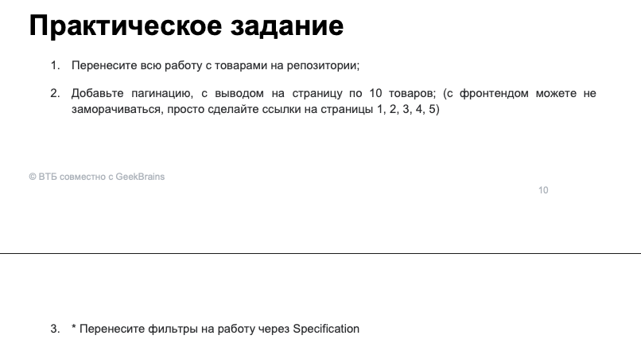
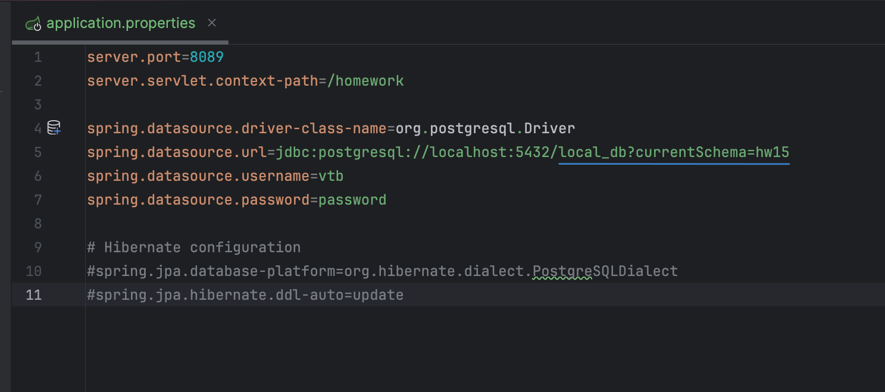
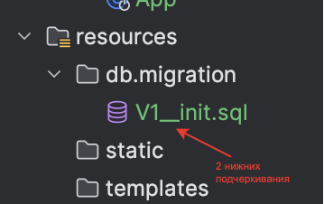
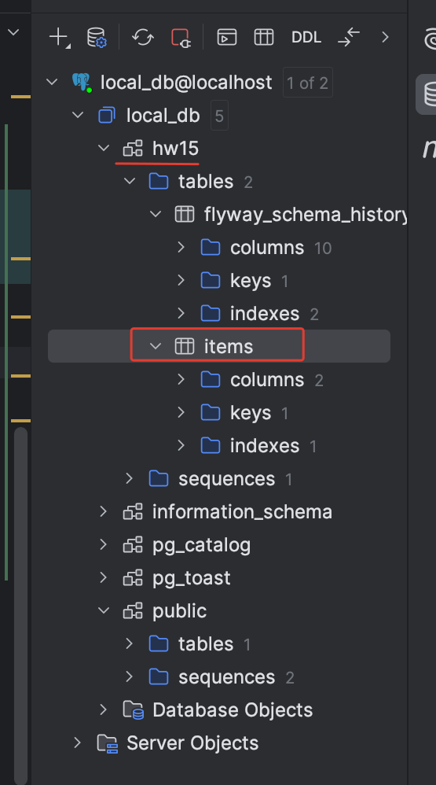
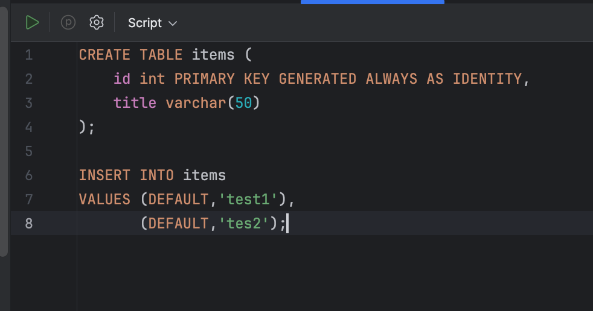
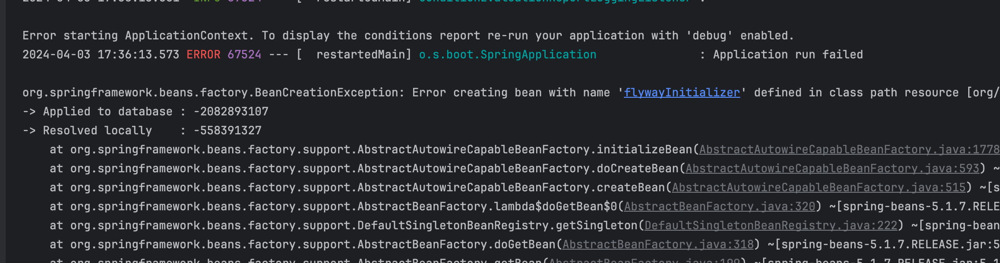
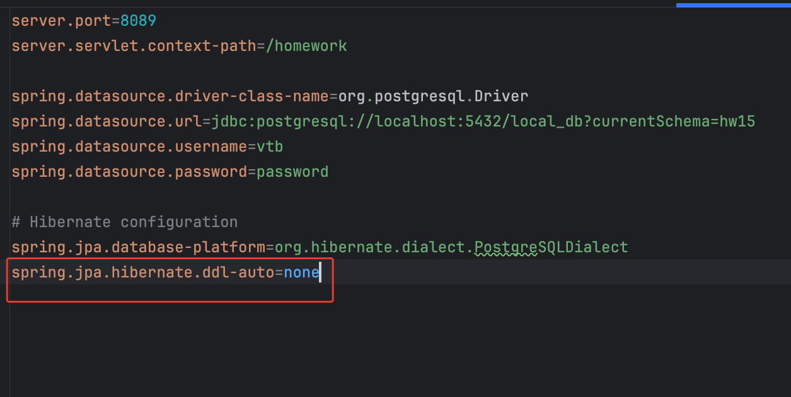

# 15. Spring Data.



Пункт 1 

Так как неоткуда переносить работу, буду создавать
с самого начала.

1 - Начинаю с `pom.xml`

2 - По окружению [см ветку](https://github.com/lalik77/geek-brains-vtb/tree/11-lecture)

3 - C запущенным контейнером PostgreSQL, заходим в него чтобы создать новую схему для flyway


`The \dn command in psql is used to list all schemas in the current PostgreSQL database.`


`Ceate new schema`


4 - Пишем в application.properties 


5 - Пишем `sql`


```sql
CREATE TABLE items (
    id int PRIMARY KEY GENERATED ALWAYS AS IDENTITY,
    title varchar(50)
);
```
Запускаем Spring Boot приложение и Flyway создал нам таблицу `items`




Если я делаю изменения в файле .sql, то получаю ошибку;  





Чтобы отключить создание entity (DDL handling) Hibernate(_ом), 
в `application.properties` добавим 



6 - Пишем след скрипт для заполнения товарами
V2__insert.sql
Дальше напишем слои (Controller, Service и Repo)

Пункт 2

1 - Пишем еще один скрипт для заполнения товарами
V4__insert.sql

2 - Реализуем пагинацию

 - `Service` слой


 - `Controller` слой


 -  `View`


[](https://youtu.be/1EZzg6mqwRQ "hw-15-2")


[PDF - Методичка 15](Java-ВТБ-Методичка-15.pdf)