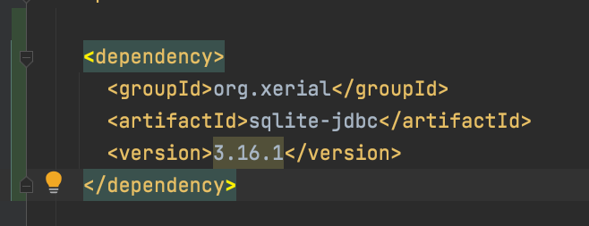
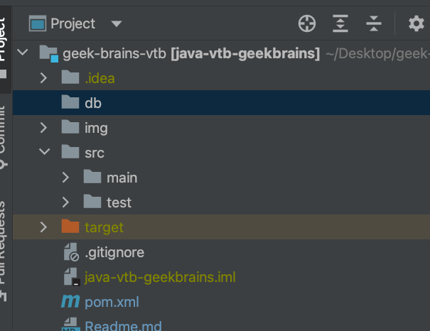
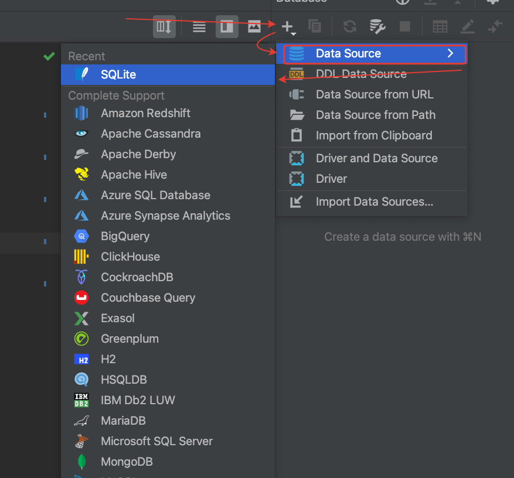
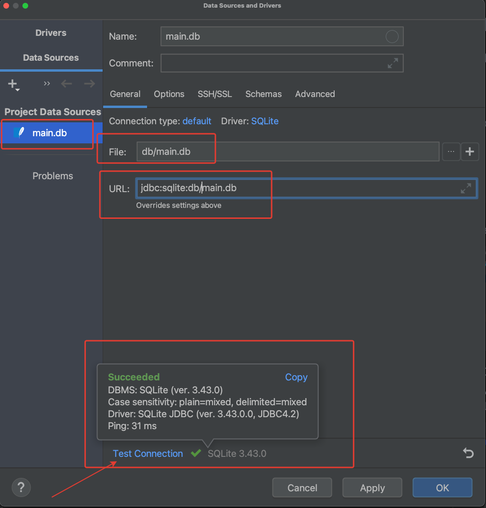
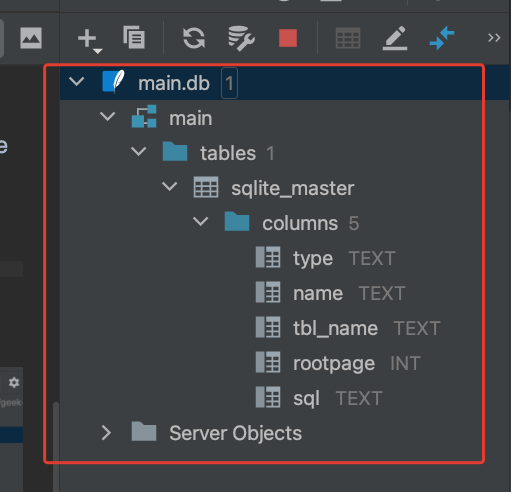
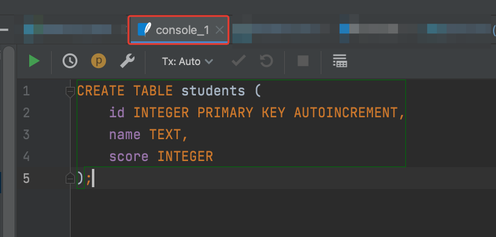
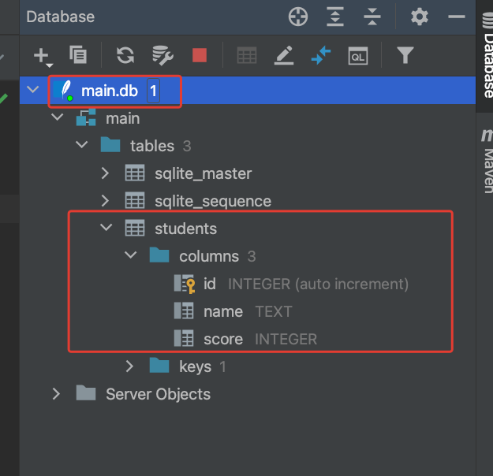

# 9 - Reflection API. JDBC.Основы PostgreSQL

Вторая часть урока, готовим окружение.  
В pom.xml добавляем зависимость как в уроке 



Создаем папку db



В IDEA ultimate edition создаем datasource SQLite




Проверяем в IDEA connection


Пишем методы `connect()` и `dicconnect()` 

```java
public class MainApp {

  private static Connection connection;
  private static Statement statement;

  public static void connect() throws SQLException {
    try {
      Class.forName("org.sqlite.JDBC");
      connection = DriverManager.getConnection("jdbc:sqlite:db/main.db");
      statement = connection.createStatement();
    } catch (ClassNotFoundException | SQLException e) {
      throw new SQLException("Unable to connect");
    }
  }

  public static void disconnect() {
    try {
      statement.close();
    } catch (SQLException throwables) {
      throwables.printStackTrace();
    }
    try {
      connection.close();
    } catch (SQLException throwables) {
      throwables.printStackTrace();
    }
  }

  public static void main(String[] args) {

    try {
      connect();

;
    } catch (SQLException throwables) {
      throwables.printStackTrace();
    } finally {
      disconnect();
    }

  }
}
```
На этом этапе все подключается и в блоке finally все отключается. 

Создаем таблицу 



Таблица создана без данных.



