# 11 - Hibernate. Часть 1.

#### 1 - Готовим окружение

Смотреть [ветку](https://github.com/lalik77/geek-brains-vtb/tree/10-lecture)

Dashboard

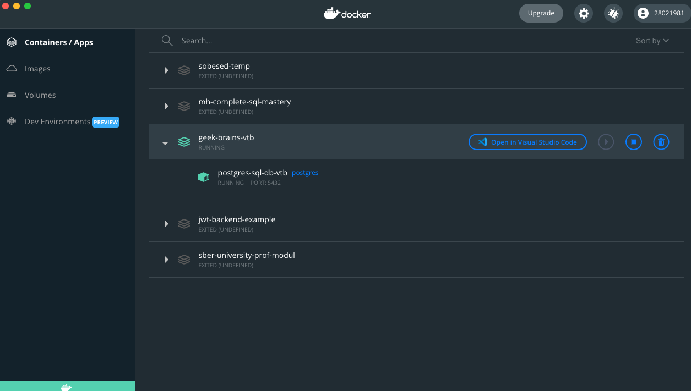

docker exec -it ....

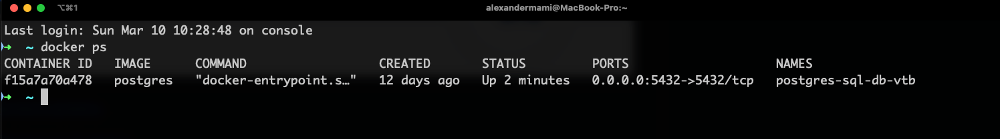

describe \d

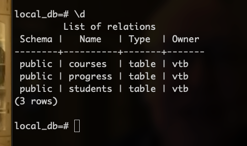

#### 2 - Домашнее задание

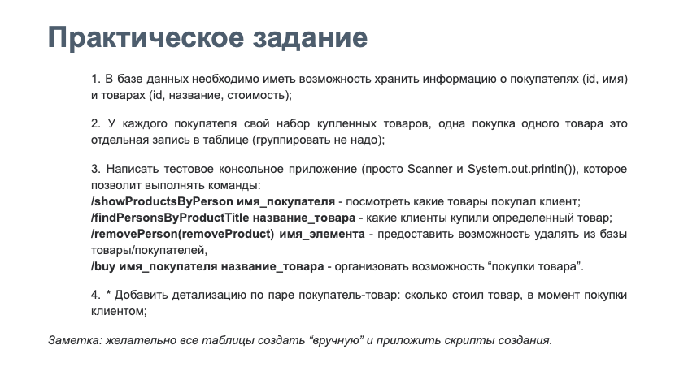

2.1 - Создадим таблицы покупатели - `customers` и товары `items`

```sql
CREATE TABLE customers
(
    id   INTEGER PRIMARY KEY GENERATED ALWAYS AS IDENTITY,
    name VARCHAR NOT NULL
);
```

```sql
CREATE TABLE items
(
    id   INTEGER PRIMARY KEY GENERATED ALWAYS AS IDENTITY,
    name VARCHAR UNIQUE NOT NULL,
    price DECIMAL(10,2) NOT NULL
);
```

2.2 - Условие задачи: у каждого покупателя свой набор купленный товаров, одна покупка одного товара - это отдельная
запись в таблице. Я понимаю так, создаем еще одну таблицу, покупатели_товары - `customers_items` или
`orders`

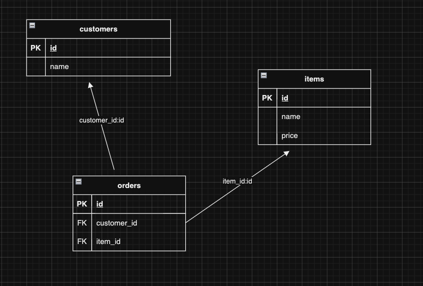

```sql
CREATE TABLE orders
(
    order_id          INTEGER PRIMARY KEY GENERATED ALWAYS AS IDENTITY,
    customer_id INTEGER,
    item_id     INTEGER,
    FOREIGN KEY (customer_id) REFERENCES customers (id),
    FOREIGN KEY (item_id) REFERENCES items (id)
);
```

2.3 - Написать тестовое консольное приложение

- Начнем с подключения Hibernate и драйвера `postgresql` в `pom.xml`

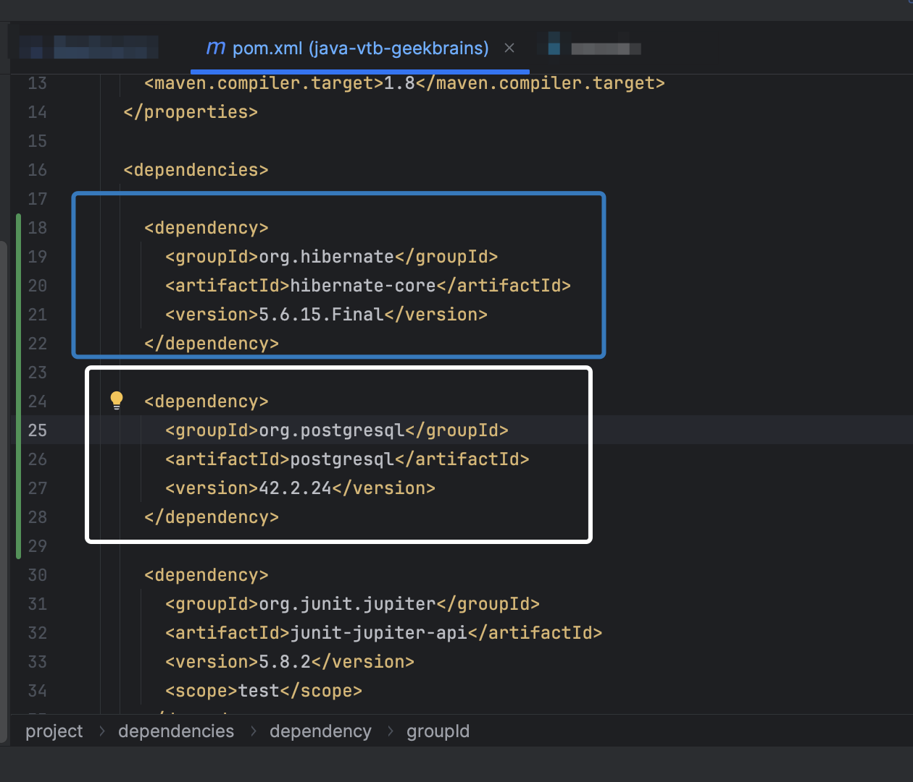

- Как в уроке создаем файл настроек hibernate.cfg.xml

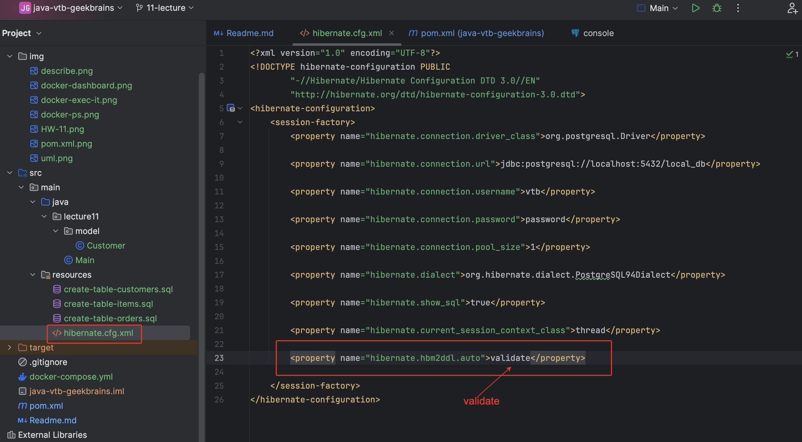

- Создадим класс `Main` для теста и новый пакет `model`, внутри пакета создаем две сущности
`Customer` и `Item`

```java
public class Main {

    public static void main(String[] args) {

        try (SessionFactory sessionFactory = new Configuration()
                .configure("hibernate.cfg.xml")
                .addAnnotatedClass(Customer.class)
                .buildSessionFactory()) {

            Session currentSession = sessionFactory.getCurrentSession();
            Customer customer1 = new Customer("Alex");
            currentSession.beginTransaction();
            currentSession.save(customer1);
            currentSession.getTransaction().commit();
        }
    }
}
```

Запускаем 
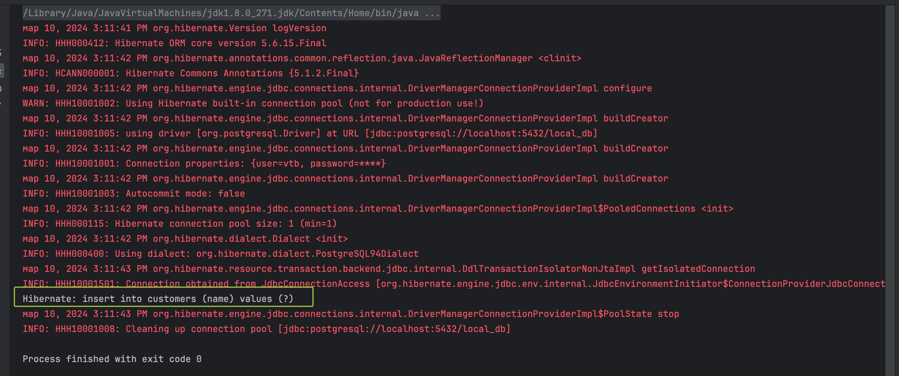

В терминале проверяем 

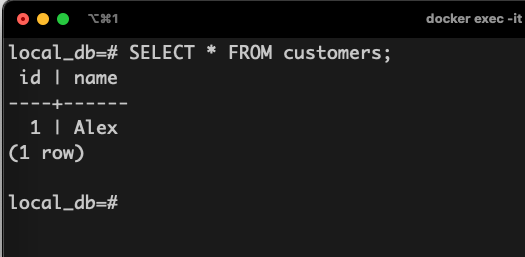

- Заполняем таблицы, я заполнял через Hibernate эти две таблицы
- Позже создал скрипты, можно их найти в `resources`. Никакого каскадирования в скриптах я 
не писал, буду писать в коде с помощью `Hibernate` 

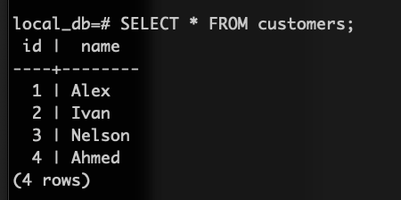
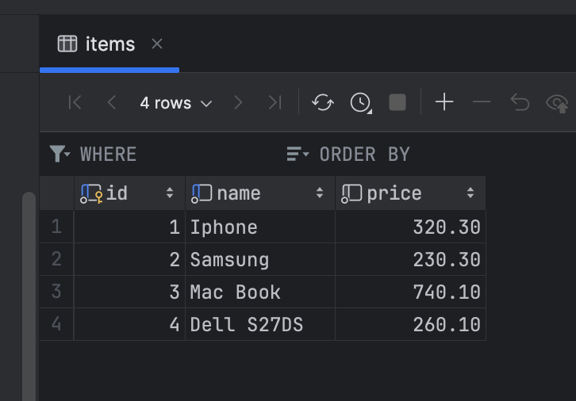

```sql
INSERT INTO orders (customer_id, item_id) VALUES (1,2);
INSERT INTO orders (customer_id, item_id) VALUES (2,1);
INSERT INTO orders (customer_id, item_id) VALUES (3,1);
INSERT INTO orders (customer_id, item_id) VALUES (1,4);
INSERT INTO orders (customer_id, item_id) VALUES (3,2);
```
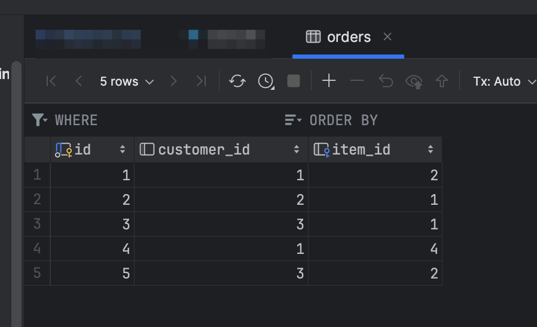

- Начинаем выставлять `ManyToMany ` отношения. 

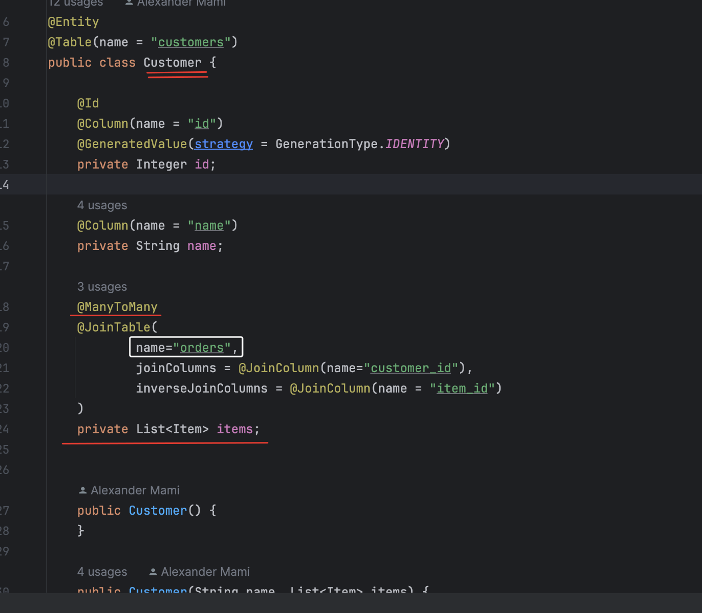
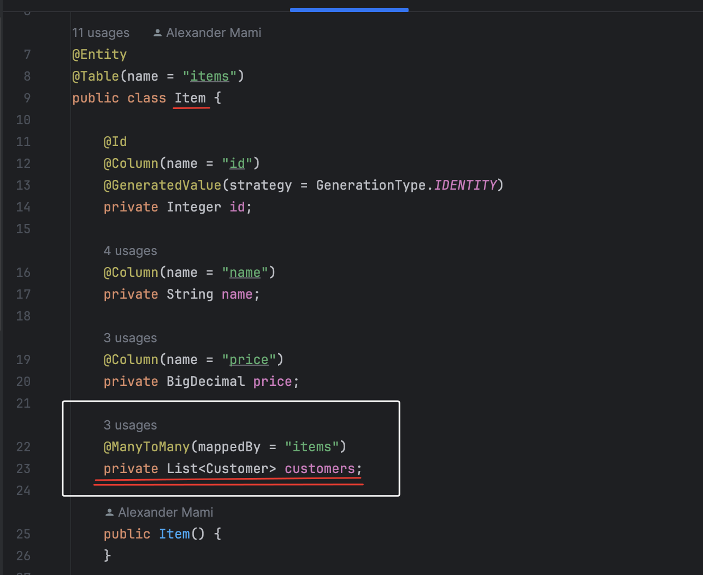

На этом коммите(_finish until removePerson_, have to add cascade.) в текущей ветке 
у нас сделано ДЗ до `/removePerson` и работает неправильно.

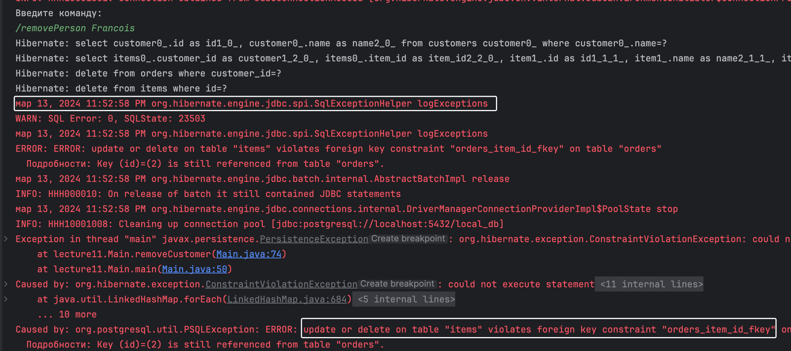
Надо поиграть с каскадированием.
Заглянем на диаграмму и на таблицу `orders` 


```sql
-- First, drop the existing foreign key constraint
ALTER TABLE orders
DROP CONSTRAINT orders_customer_id_fkey;

-- Recreate the foreign key constraint with ON DELETE SET NULL option
ALTER TABLE orders
ADD CONSTRAINT orders_customer_id_fkey
FOREIGN KEY (customer_id)
REFERENCES customers(id)
ON DELETE SET NULL;
```

```sql
-- First, drop the existing foreign key constraint
ALTER TABLE orders
    DROP CONSTRAINT orders_item_id_fkey;

-- Recreate the foreign key constraint with ON DELETE SET NULL option
ALTER TABLE orders
    ADD CONSTRAINT orders_item_id_fkey
        FOREIGN KEY (item_id)
            REFERENCES items(id)
            ON DELETE SET NULL;
```

Перепишем скрипт `create-table-orders.sql` в файл `create-table-orders-v2.sql`

- На коммите(_implement /removePerson, /removeProduct_) в текущей ветке, имплементирован механизм где мы имеем консольное приложение, которые принимает
на вход команды `/showProductsByPerson`, `/findPersonsByProductTitle`, `/removePerson` и `/removeProduct`.

[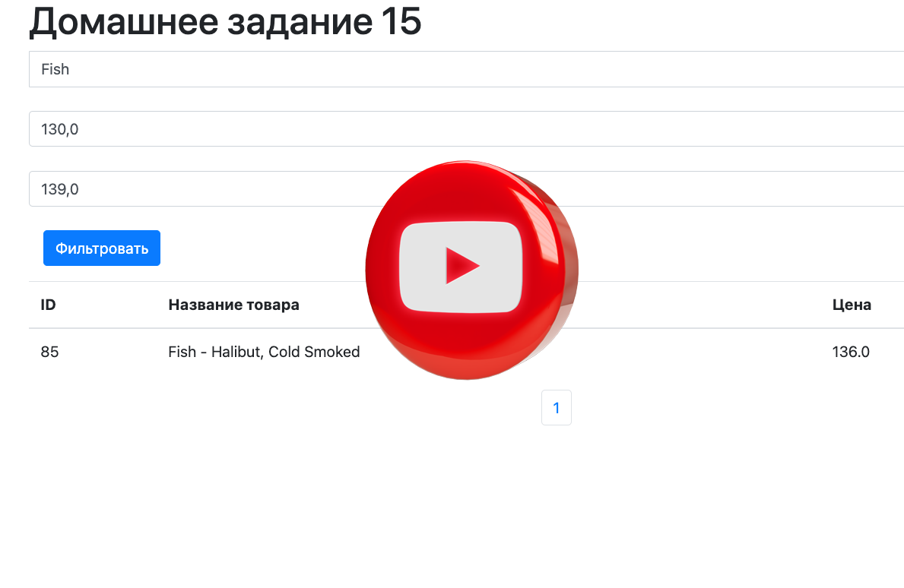](https://youtu.be/aEoC_QchBME "Presentation 1")

- На коммите(_implement /buy имя_покупателя название_товара_) в текущей ветке, 
имплементирован фунционал `/buy имя_покупателя название_товара` 


- Последний пункт домашнего задания (_последний коммит текущей ветки_): добавить детализацию по паре покупатель-товар....
Создаем таблицу `purchases` с помощью скрипта
```sql
CREATE TABLE purchases (

    id INTEGER PRIMARY KEY GENERATED ALWAYS AS IDENTITY,
    customer_id INTEGER,
    item_id     INTEGER,
    purchase_price DECIMAL(10,2),
    purchase_date TIMESTAMP
);

```

Внутри пакета помещаем новый entity class `Purchase`.
Перед запуском, удаляем все таблицы, создаем их заново с помощью скриптов. Скрипты вставки используем только 
для товаров и заказчиков.
Таблицы `orders` и `purchases`  заполняются при помощи приложения когда будем вызывать команду 
`/buy имя_покупателя название_товара`. При этом в таблице будет фиксироваться цена, та, что стоит на товар в момент
выполнения команды. 
Таблица `orders` ведет себя неправильно, при повторной покупке одним и тем же клиентом, удаляются предыдущие его заказы в
таблице orders и перезаписываются новые, с новым `id`.

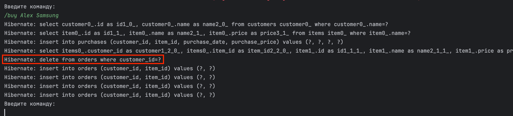

Поменял `List` на `Set`, таким образом вопрос с таблицей `orders`, был решен.

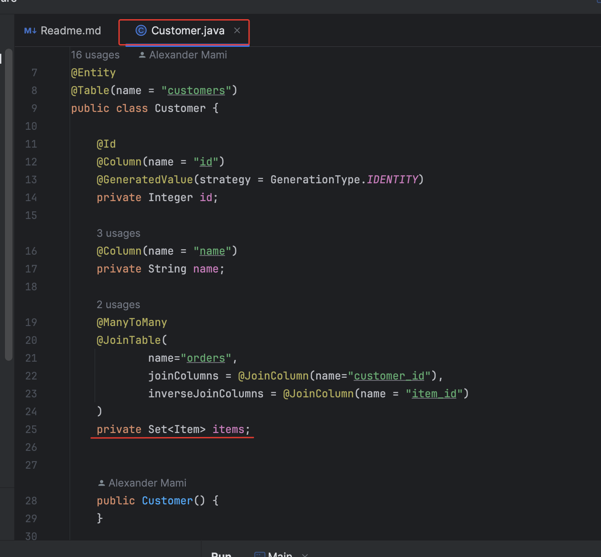

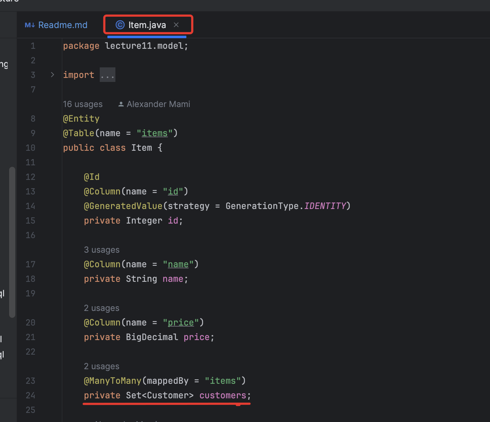

Комманды домашнего задания

/showProductsByPerson

/findPersonsByProductTitle

/removePerson

/removeProduct

/buy

/exit