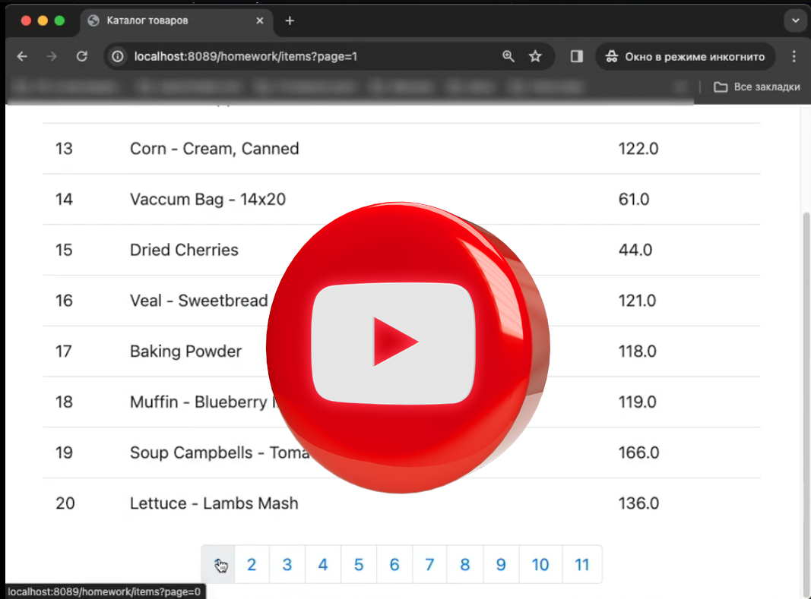

# 14. Spring Boot. Thymeleaf.Spring Security.

"Имеющий код" - это тот код с `Product` в конце лекции.
Я буду писать все с самого начала. 

1 - Настраиваю проект
Так, чтобы он был `Spring Boot` проектом и в `pom.xml` добавляю все мне 
необходимые зависимости

2 - Создаю класc `Product` и слои ( контроллер, сервис, репо )

3 - В папке `resources` создаю папку `templates`, где будут  `.html` файлы.

Приступаю к ДЗ (Обычный вариант - учитываю что добавление товара реализовано)

1 - Добавляю возможность редактировать название и цену товаров
 В контроллере добавляем два метода 

 В сервисе добавляем еще один метод

 В репозитории симулируем работу в БД 

2 - Фильтр
 
 - В  `products.html` добавляю форму над таблицей

 - В контроллере меняем метод `showProductsList`

 
3 - Добавлю удаление

 - В  `products.html` добавляю кнопку удаления

В итоге имеем 

[PDF - Методичка 14](Java-ВТБ-Методичка-14.pdf)