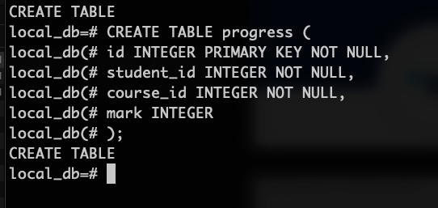
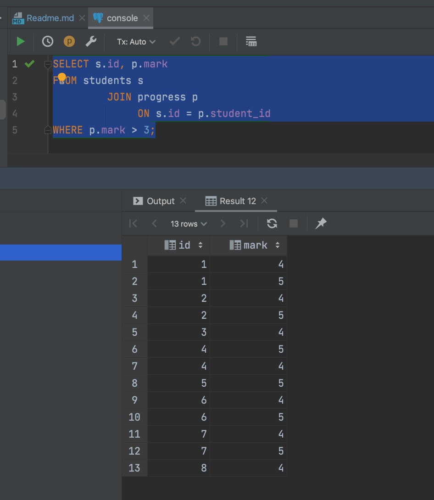

# 10 - Работа с PostgreSQL

### 1 - Готовим окружение

Создаем docker compose file, будем запускать PostgreSQL в docker


```yaml
#docker-compose up
version: "3.9"
services:
  postgres:
    container_name: postgres-sql-db-vtb
    image: postgres
    environment:
      POSTGRES_DB: "local_db"
      POSTGRES_USER: "vtb"
      POSTGRES_PASSWORD: "password"
    ports:
      - "5432:5432"
```


Add in Idea ultimate data source


Download driver

Test connection


There is an error we are connected to postgres db, we have to change it


Now all it's correct


### 2 - Домашнее задание


Работать буду в терминале как на лекции. Для работы в терминале, заходим в контейнер, для этого пишем команду

```bash
docker exec -it <container_name_or_id> psql -U <username> -d <database_name>
```

```bash
docker exec -it postgres-sql-db-vtb psql -U vtb -d local_db
```


`\l` -> list all databases


We are connected to `local_db` <br>

### 1 - Создаем таблицу students


```sql
CREATE TABLE students
(
    id              INTEGER PRIMARY KEY NOT NULL,
    passport_serial VARCHAR(10),
    passport_number VARCHAR(20)
);
```

Проверяем в IDEA


Проверяем в терминале


### 2 - Создаем таблицу subjects


```sql
CREATE TABLE subjects
(
    id     INTEGER PRIMARY KEY NOT NULL,
    course VARCHAR(20)
);
```

### 3 - Создаем таблицу progress



```sql
 CREATE TABLE progress
 (
     id         INTEGER PRIMARY KEY NOT NULL,
     student_id INTEGER             NOT NULL,
     course_id  INTEGER             NOT NULL,
     mark       INTEGER
 );
```

Проверяем в IDEA таблицы


Проверяем в терминале


### 4 - Оценка может находиться в пределах от 2 до 5

Перед добавкой constraint, проверяем в терминале как выглядит progress


```sql
ALTER TABLE progress
    ADD CONSTRAINT check_mark CHECK ( mark >= 2 AND mark <= 5 );
```

После добавки constraint, проверяем в терминале как выглядит progress


### 5 - Вывести список студентов, сдавших определенный предмет, на оценку выше 3

 5.1 - Чтобы продолжить домашнее задание, надо выставить внешние ключи с первичными ключами.


Посмотрим еще раз таблицу `progress`


Add constraint `fk_students` on `progress` table


```sql
ALTER TABLE progress
    ADD CONSTRAINT fk_students
        FOREIGN KEY (student_id)
            REFERENCES students (id);
```

Describe table `progress`


Такую же работу проделать дла внешнего ключа `fk_subjects` на таблице `progress`
Хочу добавить что дизайн и нэминг сделан неправильно, таблица `subjects` нужно было бы назвать `courses` , а
колонна `course` назвать `course_name`


```sql
ALTER TABLE progress
    ADD CONSTRAINT fk_subjects
        FOREIGN KEY (course_id)
            REFERENCES subjects (id);            
```

Посмотрим еще раз таблицу `progress`


Cгенерируем uml в IDEA 


5.2 - Сделаем рефакторинг. Нарисуем, потом удалим все таблицы и создадим новые с правильными 
названиями. 

В https://app.diagrams.net/ рисуем новую схему


Удаляем все три таблицы


Создаем все заново 
```sql
CREATE TABLE students
(
    id              INTEGER PRIMARY KEY NOT NULL,
    passport_serial VARCHAR(10),
    passport_number VARCHAR(20)
);


CREATE TABLE courses
(
    id     INTEGER PRIMARY KEY NOT NULL,
    course_name VARCHAR(20)
);


CREATE TABLE progress
(
    id         INTEGER PRIMARY KEY              NOT NULL,
    student_id INTEGER REFERENCES students (id) NOT NULL,
    course_id  INTEGER REFERENCES courses (id)  NOT NULL,
    mark       INTEGER CHECK ( mark>=2 AND mark <=5 )
);
```

Генерируем в IDEA UML, дальше буду выполнять задания с этой схемой


В терминале посмотрим как выглядит `progress`


5.3 - Заполним таблицы данными

Студенты
```sql
INSERT INTO students (id, passport_serial, passport_number) VALUES (1, 4008, 275623487);
INSERT INTO students (id, passport_serial, passport_number) VALUES (2, 4010, 275623488);
INSERT INTO students (id, passport_serial, passport_number) VALUES (3, 4011, 275623489);
INSERT INTO students (id, passport_serial, passport_number) VALUES (4, 4012, 275623490);
INSERT INTO students (id, passport_serial, passport_number) VALUES (5, 4013, 275623491);
INSERT INTO students (id, passport_serial, passport_number) VALUES (6, 4014, 275623492);
INSERT INTO students (id, passport_serial, passport_number) VALUES (7, 4014, 275623487);
INSERT INTO students (id, passport_serial, passport_number) VALUES (8, 4008, 275623487);

```

Предметы

```sql
INSERT INTO courses (id, course_name) VALUES (1, 'Mathematics');
INSERT INTO courses (id, course_name) VALUES (2, 'Physics');
INSERT INTO courses (id, course_name) VALUES (3, 'Chemistry');
INSERT INTO courses (id, course_name) VALUES (4, 'Biology');
INSERT INTO courses (id, course_name) VALUES (5, 'History');
INSERT INTO courses (id, course_name) VALUES (6, 'Literature');
INSERT INTO courses (id, course_name) VALUES (7, 'Computer Science');
INSERT INTO courses (id, course_name) VALUES (8, 'Art');
INSERT INTO courses (id, course_name) VALUES (9, 'Music');

```

Успеваемость

```sql
INSERT INTO progress (id, student_id, course_id, mark) VALUES (1, 1, 1, 4);
INSERT INTO progress (id, student_id, course_id, mark) VALUES (2, 1, 2, 3);
INSERT INTO progress (id, student_id, course_id, mark) VALUES (3, 1, 3, 5);
INSERT INTO progress (id, student_id, course_id, mark) VALUES (4, 2, 1, 3);
INSERT INTO progress (id, student_id, course_id, mark) VALUES (5, 2, 3, 4);
INSERT INTO progress (id, student_id, course_id, mark) VALUES (6, 2, 4, 5);
INSERT INTO progress (id, student_id, course_id, mark) VALUES (7, 3, 1, 2);
INSERT INTO progress (id, student_id, course_id, mark) VALUES (8, 3, 5, 4);
INSERT INTO progress (id, student_id, course_id, mark) VALUES (9, 3, 6, 3);
INSERT INTO progress (id, student_id, course_id, mark) VALUES (10, 4, 1, 5);
INSERT INTO progress (id, student_id, course_id, mark) VALUES (11, 4, 3, 3);
INSERT INTO progress (id, student_id, course_id, mark) VALUES (12, 4, 5, 4);
INSERT INTO progress (id, student_id, course_id, mark) VALUES (13, 5, 2, 5);
INSERT INTO progress (id, student_id, course_id, mark) VALUES (14, 5, 4, 2);
INSERT INTO progress (id, student_id, course_id, mark) VALUES (15, 5, 6, 3);
INSERT INTO progress (id, student_id, course_id, mark) VALUES (16, 6, 1, 4);
INSERT INTO progress (id, student_id, course_id, mark) VALUES (17, 6, 3, 5);
INSERT INTO progress (id, student_id, course_id, mark) VALUES (18, 6, 5, 2);
INSERT INTO progress (id, student_id, course_id, mark) VALUES (19, 7, 2, 3);
INSERT INTO progress (id, student_id, course_id, mark) VALUES (20, 7, 4, 4);
INSERT INTO progress (id, student_id, course_id, mark) VALUES (21, 7, 6, 5);
INSERT INTO progress (id, student_id, course_id, mark) VALUES (22, 8, 1, 4);
INSERT INTO progress (id, student_id, course_id, mark) VALUES (23, 8, 3, 3);
INSERT INTO progress (id, student_id, course_id, mark) VALUES (24, 8, 5, 2);
```

5.4 - Приступим к заданию:
Вывести список студентов, сдавших определенный предмет, на оценку выше 3

Вывести список id студентов у которых оценки выше 3
```sql
SELECT s.id, p.mark
FROM students s
         JOIN progress p
              ON s.id = p.student_id
WHERE p.mark > 3;
```


Вывести список студентов у которых оценка выше 3 по определенному предмету

```sql
SELECT s.id, p.mark
FROM students s
         JOIN progress p
              ON s.id = p.student_id
         JOIN courses c on p.course_id = c.id
WHERE p.mark > 3
  AND course_name = 'Mathematics';
```


### 6 - При удалении студента из таблицы, вся его успеваемость тоже должна быть удалена


В терминале 
Посмотрим на `students`


Посмотрим на `courses`


Посмотрим на `progress`


Удалим `FOREIGN KEY` потом создадим новый CONSTRAINT 


```sql
ALTER table progress
ADD CONSTRAINT fk_student_id
FOREIGN KEY (student_id) REFERENCES students(id) ON DELETE CASCADE ;
```
Посмотрим на `progress`


Проверим. В таблице `students`  у нас есть эти записи.


В `progress` мы имеем эти записи


Запускаем скрипт
```sql
DELETE FROM students
WHERE id=1;
```
Смотрим `students`


### 7 - Посчитать средний бал по определенному предмету

Так как курс я нашел в интернете и спросить некого буду пытаться понять задачу сам.
По определенному предмету, надо суммировать все записи и разделить на количество записей. 

Сделаем выборку всех записей где предмет с id = 3 


```sql
SELECT AVG(mark) AS average_mark
FROM progress
WHERE course_id = 3;
```
In Terminal


In Idea


### 8 - Посчитать средний бал по определенному студенту


4 + 5 + 2 = 11, 11 / 3 = 3,66


### 9 - Пара серия-номер паспорта должны быть уникальны в таблице `students`

Запускаем скрипт

```sql
ALTER TABLE students
ADD CONSTRAINT unique_passport
UNIQUE (passport_serial,passport_number);
```


Посмотрим что содержит таблица студенты


Попробуем внести повторяющую пару, например `4008 275623487`

```sql
INSERT INTO students(id, passport_serial, passport_number)
VALUES (9, 4008, 275623487);
```


### 10 - Найти три предмета, которые сдали наибольшее количество студентов

